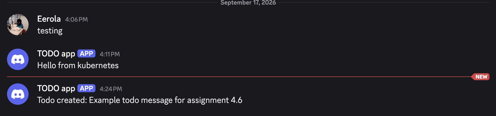
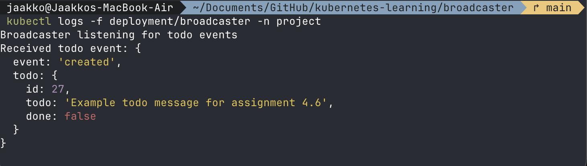
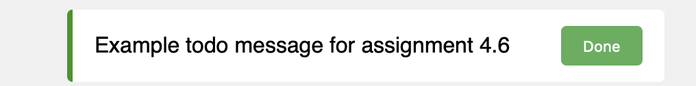
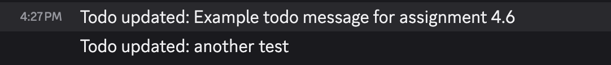

# Example of a working broadcaster

## Screenshots

1. Sceenshot from Discord channel 
2. Sceenshot from broadcaster logs 
3. Sceenshot from the TODO application 
4. Sceenshot from Discord channel with updated TODO 
